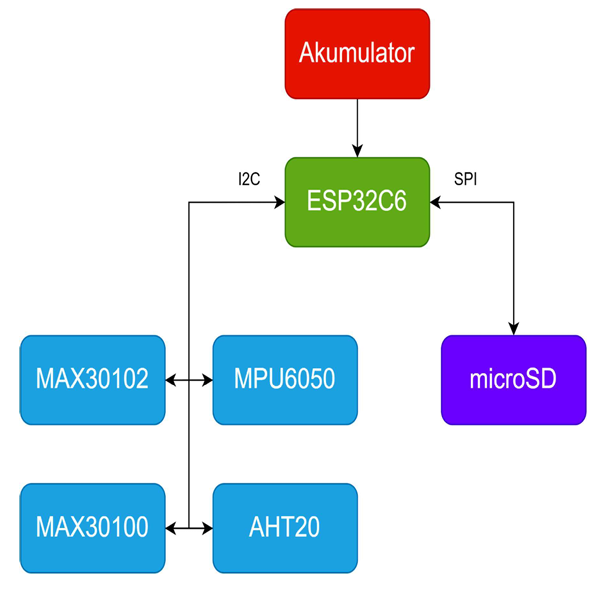
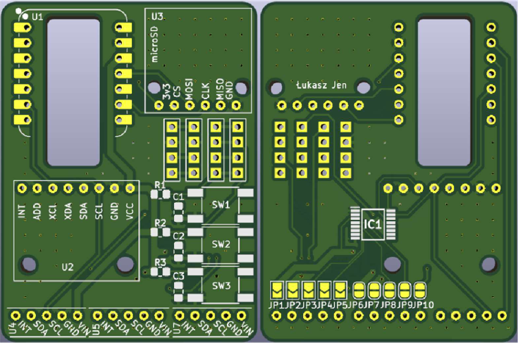
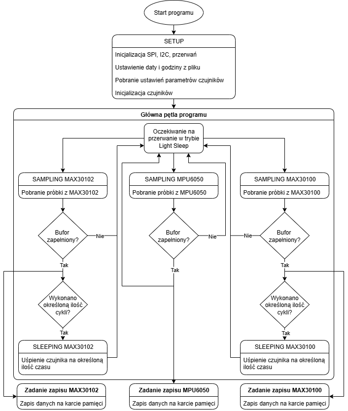
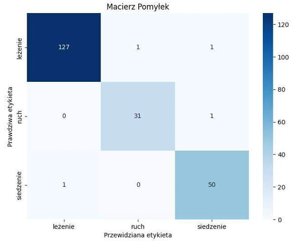
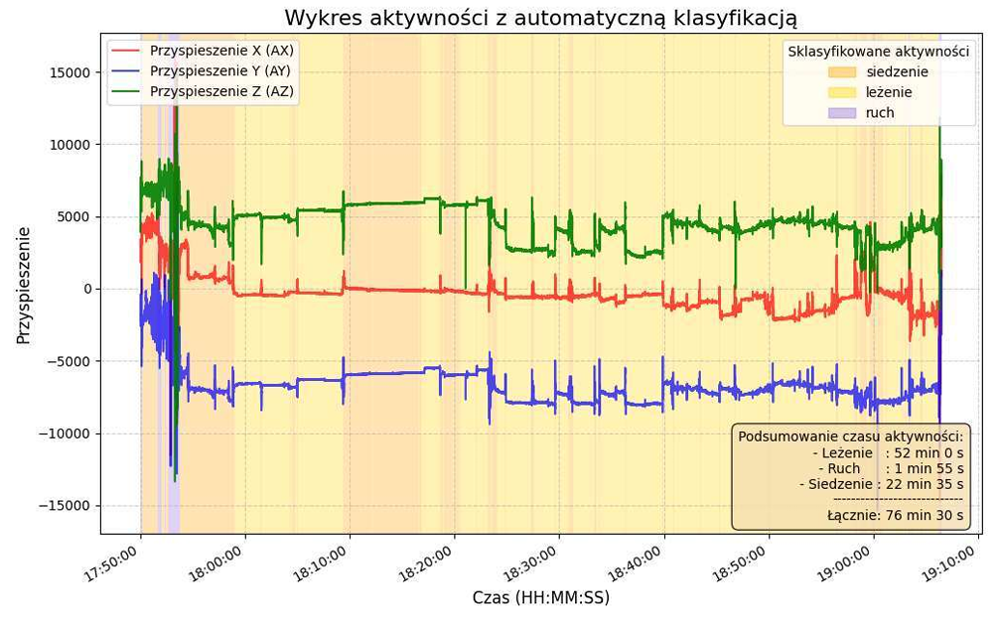

# CyberCat - KotoSzelki
### Elektroniczny system diagnostyczno-pomiarowy do oceny aktywności fizycznej i parametrów życiowych kotów
### _Electronic diagnostic and measurement system for assessing physical activity and vital parameters of cats_

Projekt zrealizowany w ramach pracy magisterskiej. Jest to w pełni funkcjonalny, noszony system diagnostyczno-pomiarowy w formie szelek, przeznaczony do monitorowania aktywności fizycznej i kluczowych parametrów życiowych kotów domowych. Urządzenie autonomicznie zbiera dane z wielu czujników, zapisuje je na karcie microSD, a zebrane informacje są następnie analizowane za pomocą dedykowanego oprogramowania w języku Python, które wykorzystuje m.in. modele uczenia maszynowego do automatycznej klasyfikacji zachowań.

  
   
  <em>Rys. 1. Prototyp urządzenia podczas testów.</em>

---

## Kluczowe Funkcje

- 🐱 **Kompleksowy Monitoring:** Jednoczesny pomiar:
    - **Tętna (HR) i zmienności rytmu serca (HRV)** za pomocą czujnika fotopletyzmograficznego (PPG).
    - **Częstości oddechów (BR)** z wykorzystaniem drugiego czujnika PPG do detekcji ruchów klatki piersiowej.
    - **Aktywności fizycznej** przy użyciu 6-osiowego modułu IMU (akcelerometr + żyroskop).
- 🧠 **Klasyfikacja Aktywności z Użyciem AI:** Automatyczna klasyfikacja trzech kluczowych stanów (leżenie, siedzenie, ruch) z wykorzystaniem wytrenowanego modelu **Random Forest**, osiągając dokładność **98.11%**.
- 🔋 **Niskie Zużycie Energii:** Architektura oparta o system operacyjny czasu rzeczywistego **FreeRTOS**, tryb `Light Sleep` oraz przerwania od czujników, co pozwala na wielogodzinne, ciągłe działanie na baterii Li-Po.
- 💾 **Rejestracja Danych Offline:** Wszystkie surowe dane z czujników są zapisywane na karcie **microSD**, co umożliwia szczegółową analizę na komputerze.
- 🛠️ **Własny Projekt Hardware:** System jest oparty o dedykowaną, autorską płytkę **PCB** zaprojektowaną w celu integracji wszystkich komponentów w miniaturowej formie.

---

## Architektura Systemu

Sercem urządzenia jest mikrokontroler **ESP32C6**, który zarządza komunikacją z sensorami poprzez magistralę I²C oraz zapisem danych na karcie microSD przez interfejs SPI.

  
   
  <em>Rys. 2. Schemat blokowy architektury sprzętowej.</em>

  
   
  <em>Rys. 3. Wizualizacja zaprojektowanej, dwuwarstwowej płytki PCB.</em>

---

## Oprogramowanie Wbudowane (Firmware)

Oprogramowanie mikrokontrolera zostało oparte o system operacyjny czasu rzeczywistego **FreeRTOS**, co pozwoliło na modularną i niezawodną architekturę. Główne zadania systemowe:
- **Pętla Główna:** Odpowiada za odczyt próbek z czujników w reakcji na przerwania sprzętowe i zarządzanie trybami niskiego zużycia energii (`Light Sleep`).
- **Niezależne Zadania Zapisu:** Dedykowane zadania (tasks) dla każdego strumienia danych (PPG, IMU, oddech), które w tle obsługują zapis zapełnionych buforów na kartę microSD.
- **Mechanizmy Synchronizacji:**
  - **Semafory binarne** są używane jako flagi sygnalizacyjne do odblokowywania zadań zapisu po zapełnieniu bufora.
  - **Mutex** chroni dostęp do współdzielonego zasobu (magistrala SPI karty microSD), zapobiegając uszkodzeniu danych.

  
   
  <em>Rys. 4. Graf oprogramowania mikrokontrolera z podziałem na zadania.</em>

---

## Analiza Danych i Uczenie Maszynowe

Zebrane dane są przetwarzane offline za pomocą skryptów w języku Python.

#### Klasyfikacja Aktywności
1.  **Ekstrakcja Cech:** Z 5-sekundowych okien sygnału IMU ekstrahowane są cechy statystyczne i częstotliwościowe (średnia, wariancja, energia, dominująca częstotliwość itp.), tworząc 108-elementowy wektor cech.
2.  **Trenowanie Modelu:** Model **Lasu Losowego (Random Forest)** został wytrenowany na zbiorze danych z etykietami.
3.  **Wyniki:** Model osiągnął dokładność **98.11%** na zbiorze testowym, skutecznie odróżniając ruch od stanów statycznych.

  
   
  <em>Rys. 5. Macierz pomyłek dla 9-osiowego modelu Lasu Losowego.</em>

  
   
  <em>Rys. 6. Wykres sygnałów z akcelerometru z nałożonymi wynikami automatycznej klasyfikacji.</em>

#### Analiza Tętna i Oddechu
Dane z czujników PPG są przetwarzane w celu usunięcia artefaktów ruchowych (z wykorzystaniem danych z IMU), a następnie analizowane przy użyciu biblioteki **HeartPy** (sygnał HR) do detekcji pików i obliczania tętna oraz jego zmienności. Podobny potok przetwarzania jest stosowany do estymacji częstości oddechów (analiza przy pomocy własnego algorytmu).

---

## Licencja

Ten projekt jest udostępniony na licencji MIT - zobacz plik [LICENSE](LICENSE) po szczegóły.